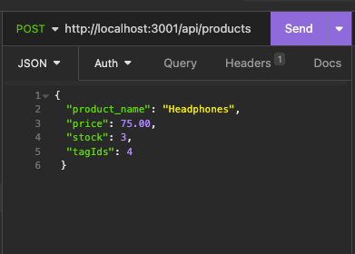

# module-thirteen-challenge
E-Commerce Back End

## Description

The goal of this project was to build the back end for an e-commerce site. 

## Installation

1. Clone the repository: 
git clone https://github.com/your/repository.git

2. Install the dependencies: 
cd project-directory
npm install

## Usage

This project is a functional Express.js API that allows you to connect to a MySQL database using Sequelize. It provides various routes for retrieving and manipulating data related to categories, products, and tags.

Please refer to the video at the following link to see a walkthrough video demonstration for this application: https://youtu.be/Dst-STilwAc

## Credits

Starter files can be found by going to the following link: https://github.com/coding-boot-camp/fantastic-umbrella

## License

Please refer to the license in the repo